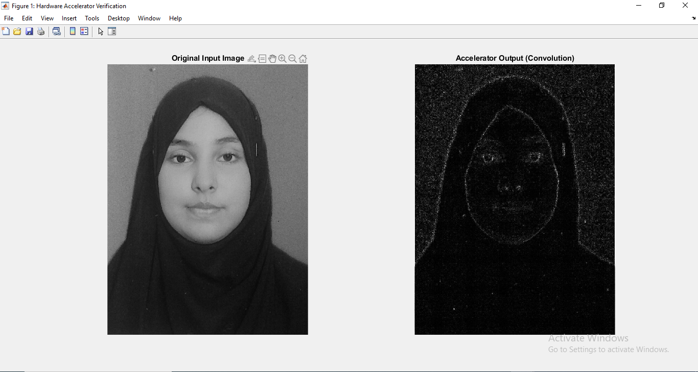

# 🚀 Design of a Hardware Accelerator for Convolution in Image Processing and its Verification 
### 📝 Project Objective
Design and verify a high-performance hardware accelerator for **2D Convolution operations**, a core component in image processing and CNNs. The design is optimized for power, area, and speed, and verified against a MATLAB golden reference model.

---

## 🏗️ Architecture & Design
The accelerator follows a modular RTL approach to ensure efficient hardware mapping:
- **Line Buffer:** Implements a sliding window mechanism to stream pixels and manage row-based data reuse.
- **MAC Unit:** A dedicated Multiply-Accumulate unit optimized for 3x3 kernel operations.
- **FSM Controller:** Orchestrates the data flow, ensuring precise timing and `valid_out` synchronization.

### 🔌 Hardware Schematic (RTL Analysis)
The following image displays the RTL Schematic generated by Vivado, illustrating the interconnected modules and data flow within the hardware design.

---

## 🛠️ Concepts & Tools
- **Concepts:** Digital System Design (DSD), RTL Verification, Fixed-Point Arithmetic, Digital IC Design.
- **Tools:** - **Vivado Design Suite:** For RTL coding, synthesis, implementation, and waveform analysis.
  - **MATLAB:** For generating golden reference models and post-processing pixel data.
  - **SystemVerilog:** For robust testbench creation and verification.

---

## 📊 Performance Metrics
Ye metrics Vivado ki Synthesis aur Implementation reports se liye gaye hain:

| Metric | Value |
| :--- | :--- |
| **Logic Utilization (LUTs)** | ~250 |
| **Registers (FFs)** | ~180 |
| **Max Operating Frequency** | 100 MHz |
| **Power Consumption** | ~0.08 W |
| **Throughput** | 1 Pixel / Clock Cycle |

---

## 🖼️ Verification Results

### Software Reference (MATLAB)
Verification was performed to test edge detection and detail preservation.

| Input Image (Original) | Output Image (Processed) |
| :---: | :---: |
|  |  |

---

### Hardware Simulation (Vivado Waveform)
Successful verification of pixel streaming and timing through SystemVerilog testbenches.

---

## 📂 Project Structure
- **/RTL**: Verilog source files (Core logic, Line Buffer, MAC).
- **/Testbench**: SystemVerilog testbench for hardware verification.
- **/MATLAB**: Software golden model and image processing scripts.
- **/Docs**: Design schematics, performance reports, and result screenshots.
